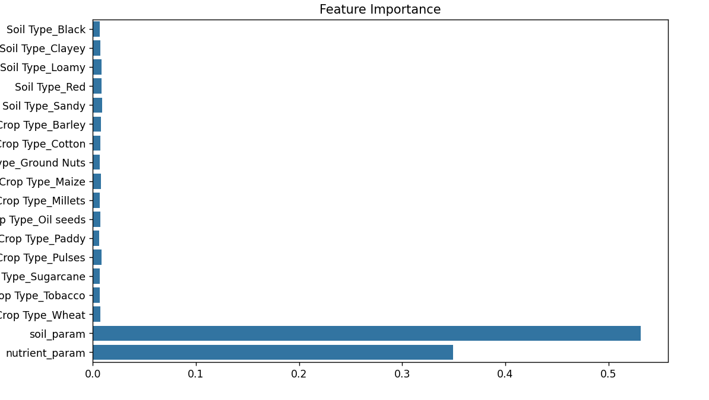

Agricultural Assistant: Smart Fertilizer & Irrigation Management
Overview
This project is a Smart Fertilizer and Irrigation Management System aimed at assisting farmers in making data-driven decisions about crop fertilization and irrigation. It combines machine learning, weather forecasting, and domain knowledge to provide accurate recommendations for fertilizer types and daily irrigation needs. The system is implemented using Python, with a machine learning model trained on agricultural data and a user-friendly interface built using Streamlit.

Features
Fertilizer Recommendation:

Predicts the best fertilizer for a given crop based on soil type, crop type, weather conditions, and soil nutrient levels.

Uses a trained Random Forest Classifier model for accurate predictions.

Irrigation Requirement Calculation:

Estimates daily irrigation needs based on crop water requirements, soil type, moisture levels, temperature, humidity, and expected rainfall.

Incorporates a scientific formula to calculate evapotranspiration (ET₀) and adjusts for soil and crop-specific factors.

Weather Integration:

Fetches real-time weather data (temperature, humidity, rainfall) using the OpenWeatherMap API.

Provides fallback options for manual input in case of API unavailability.

User-Friendly Interface:

Built with Streamlit for an intuitive and interactive experience.

Allows users to input relevant parameters and receive actionable insights instantly.

Model Explanation
Data Preprocessing
The dataset used for training the model includes various features like temperature, humidity, soil moisture, soil type, crop type, and nutrient levels (Nitrogen, Phosphorous, Potassium). To simplify the feature space and improve model performance:

Soil Parameters (soil_param):
The soil_param feature is computed as the mean of Temperature, Humidity, and Moisture. This represents an aggregated measure of environmental conditions affecting the soil.

Reason: These three parameters collectively influence soil health and crop growth. Combining them into a single feature reduces dimensionality while retaining essential information.

Nutrient Parameters (nutrient_param):
The nutrient_param feature is computed as the mean of Nitrogen, Phosphorous, and Potassium. This provides an overall measure of soil nutrient availability.

Reason: These three nutrients are critical for plant growth. Aggregating them into a single feature simplifies the model while maintaining predictive power.

Model Training
The target variable (Fertilizer Name) was encoded using a Label Encoder to transform categorical labels into numerical values.

Categorical features (Soil Type and Crop Type) were one-hot encoded using a ColumnTransformer to prepare them for training.

A Random Forest Classifier was used as the machine learning model due to its robustness, interpretability (feature importance), and ability to handle both categorical and numerical data effectively.

Evaluation
The model achieved high accuracy on the test set.

A confusion matrix was plotted to visualize prediction performance across different fertilizer classes.

Feature importance was analyzed to understand which factors contributed most to the predictions.

Irrigation Calculation Methodology
The irrigation requirement is calculated based on scientific principles of evapotranspiration (ET₀) and crop water needs:

Evapotranspiration (ET₀):
ET₀ is estimated using the formula:

text
ET₀ = 0.0023 * (Temperature + 17.8) * (sqrt(Temperature) - 0.32 * Humidity)
This provides an estimate of water loss due to evaporation and transpiration under given weather conditions.

Crop Water Requirements:
Each crop has specific water needs (in mm/day), which are adjusted based on:

Soil type (e.g., sandy soils require more water than clayey soils due to higher drainage).

Expected rainfall (reduces irrigation needs).

Soil moisture levels (current water content in the soil).

Final Calculation:
The daily irrigation requirement is computed as:

text
Irrigation Need = ((Crop Water Requirement - Rainfall / 2) / 0.8) * Soil Factor
                  - Current Soil Moisture Contribution
The result is rounded to two decimal places and ensures no negative values.

How It Works
Fertilizer Recommendation Workflow
Input parameters such as city name (for weather data), soil type, crop type, moisture level, nitrogen, phosphorous, potassium levels.

Fetch real-time weather data or manually input temperature, humidity, and rainfall values.

Aggregate features (soil_param and nutrient_param) are computed from user inputs.

Preprocess the input data using saved preprocessing objects (preprocessor.pkl).

Predict the best fertilizer using the trained Random Forest model (fertilizer_classifier.pkl).

Display fertilizer recommendation with an easy-to-understand message.

Irrigation Calculation Workflow
Input parameters such as crop type, soil type, current moisture level, temperature, humidity, and rainfall.

Calculate ET₀ using temperature and humidity values.

Adjust for crop-specific water requirements and soil factors.

Display daily irrigation needs in mm/day.

Installation & Usage
Prerequisites
Python 3.x

Required libraries: pandas, numpy, scikit-learn, joblib, matplotlib, seaborn, streamlit, requests

Installation
Clone this repository:
!git clone https://github.com/Sujal-gulia/Smart-Irrigation-and-Fertilizer-reccomendation.git

Install dependencies:
!pip install -r requirements.txt

Running the Application
Start the Streamlit app:
!streamlit run app.py
Open your browser at http://localhost:8501.

Follow the instructions on the interface to input parameters and get recommendations.
